# The Equal Experts Java Quest

A personal accountability tracker for a 24-week Java Developer study plan — the path to landing a role at Equal Experts. Zero-dependency single-page web app, plus a pair of scheduled remote agents that send daily personalised reminders.

> **Status:** in active use · **Quest start date:** 2026-05-27 · **Target:** EE application after Week 24

---

## Quick start

```bash
# 1. Open the app
open index.html        # macOS
# or just double-click index.html

# 2. (Optional) Run the tests
open tests/test.html

# 3. (Optional) Connect GitHub sync so the daily reminders see your real progress
#    See docs/operations.md → "GitHub sync"
```

No build step. No `npm install`. No server. The app runs entirely from `file://`.

---

## What it does

| Feature | Where |
|---|---|
| Track 24 weeks across 5 phases + 5 boss battles | Dashboard / Week view |
| Tick 4 daily tasks per week (reading · Pluralsight · coding · YouTube) | Week view |
| Persistent reflection notes per week | Week view |
| 10 auto-unlocking achievement badges | Badge wall |
| Daily streak counter | Dashboard |
| Rotating craftsmanship quote (13, by Beck / Fowler / Farley / Martin / …) | Dashboard |
| Stats: weeks, bosses, current phase, days elapsed, projected finish | Stats view |
| Dark / light theme toggle | Settings |
| Export / import progress as JSON | Settings |
| Optional GitHub sync of `state.json` (via PAT) | Settings |
| Daily personalised reminders at 08:00 + 16:00 SAST | [Remote routines](#scheduled-reminders) |

---

## Repository standards

This repo follows the project standards that apply to every misc repo:

| Standard | Where |
|---|---|
| Clean architecture (pure core / adapter shell) | [`docs/architecture.md`](docs/architecture.md) |
| TDD with browser-runnable tests | [`docs/testing.md`](docs/testing.md), [`tests/`](tests/) |
| Architectural diagrams (SVG, not raw Mermaid) | [`docs/diagrams/`](docs/diagrams/) |
| ADRs for material decisions | [`docs/adr/`](docs/adr/) |
| Operations + runbook | [`docs/operations.md`](docs/operations.md) |
| Contributing rules | [`CONTRIBUTING.md`](CONTRIBUTING.md) |
| Versioned changes | [`CHANGELOG.md`](CHANGELOG.md) |

---

## Architecture at a glance

The app is a **hexagonal mini-architecture**: a pure JavaScript core (`lib/quest-core.js`) surrounded by a thin shell that handles all IO (DOM, `localStorage`, GitHub API).



The pure core is what gets unit-tested. The shell is exercised manually in the browser.

See [`docs/architecture.md`](docs/architecture.md) for the full container, sequence, state-machine, and data-model diagrams.

---

## Scheduled reminders

Two cron routines fire every day, personalised against the *actual* week you're on (computed from `state.json` if synced, else from the start-date calendar):

| Routine | When | UTC cron | URL |
|---|---|---|---|
| Morning Nudge | 08:00 SAST | `0 6 * * *` | https://claude.ai/code/routines/trig_01J2nejch5Ub8AzmfSeGhDHu |
| Afternoon Check-in | 16:00 SAST | `0 14 * * *` | https://claude.ai/code/routines/trig_011WzA6osumwnUBdDK2CqCwz |

Reminder logic (read `state.json` → compute gap vs calendar → emit markdown) is documented in [`docs/operations.md`](docs/operations.md) and visualised here:



---

## Project layout

```
ee-java-quest/
├── index.html                  # The app shell (DOM, IO, theme, sync)
├── lib/
│   └── quest-core.js           # Pure domain: PHASES, BADGES, helpers
├── tests/
│   ├── test.html               # Browser test runner (open in a browser)
│   └── quest-core.test.js      # Unit tests against the pure core
├── docs/
│   ├── architecture.md         # System design + all diagrams
│   ├── testing.md              # TDD policy + how to extend tests
│   ├── operations.md           # Cron routines + GitHub sync runbook
│   ├── adr/                    # Architecture Decision Records
│   └── diagrams/               # Mermaid sources + rendered SVGs
├── CHANGELOG.md
├── CONTRIBUTING.md
├── LICENSE                     # MIT
└── README.md
```

---

## License

MIT — see [`LICENSE`](LICENSE).
