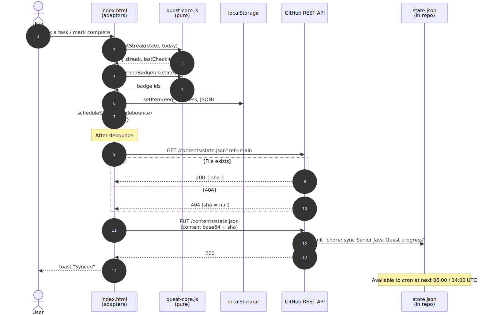

# Architecture

## Goals

1. **Zero install, zero build** — the app must run by opening one file in a browser.
2. **Testable core** — the rules of the quest (phase status, week computation, achievement unlocks, streak transitions) must be unit-testable in isolation, without DOM, network, or storage.
3. **Progress-aware reminders** — a separate scheduled agent must be able to read the same state model that the app produces.
4. **No PII leaks** — secrets (GitHub PAT) stay client-side; only progress data is pushed remotely.

---

## Pattern: hexagonal core + adapter shell

The app deliberately separates **pure domain logic** (the "core") from everything else (the "shell"). This is sometimes called *ports and adapters*, *clean architecture*, or *the functional core, imperative shell* pattern.

| Layer | File | Responsibilities | Side effects? |
|---|---|---|---|
| **Core (pure)** | `lib/quest-core.js` | Data model, phase state machine, achievement rules, week/streak/quote computation, default-state factory | None |
| **Shell (adapter)** | `index.html` (inline `<script>`) | DOM rendering, event handlers, `localStorage` IO, GitHub REST sync, theme, toast/modal/confetti, debouncing | Yes — DOM, storage, network, timers |
| **Persistence** | Browser `localStorage` (`eeq_progress`, `eeq_sync`) | Local-first state | — |
| **Remote sync** | GitHub Contents API | Optional state mirror (`state.json` in this repo) | — |
| **Scheduled reminders** | `claude.ai/code/routines` (2 cron routines) | Reads `state.json` from this repo, emits personalised markdown | — |

The shell *depends on* the core. The core does **not** depend on the shell. This is the boundary that makes TDD possible.

---

## System context

Who/what talks to what:


[Mermaid source](../diagrams/context.mmd)

---

## Containers and internals

Where the moving parts actually live:



[Mermaid source](../diagrams/container.mmd)

Key points:

- `quest-core.js` is loaded via a plain `<script src="lib/quest-core.js">` — no module system, exposes a single global `window.QuestCore` namespace.
- `index.html` destructures `window.QuestCore` once at the top of its main script. Everything downstream uses local bindings.
- `localStorage` keys are deliberately namespaced:
  - `eeq_progress` — the user's quest state (sync-safe, gets pushed to `state.json`)
  - `eeq_sync` — sync config including the PAT (**never** pushed remotely)

---

## Data model

```
State (eeq_progress in localStorage, mirrored as state.json in repo)
├── progress: { w1..w24 → { tasks: [bool×4], reflection: string, complete: bool } }
├── bossBattles: { p1..p5 → bool }
├── achievements: [badgeId, …]
├── startDate: ISO date string
├── theme: "dark" | "light"
├── lastCheckIn: ISO date string | null
└── streak: number
```



[Mermaid source](../diagrams/data-model.mmd)

The `SyncConfig` (token, owner, repo, branch, last-synced timestamps) lives in a **separate** `localStorage` key (`eeq_sync`) and is **never** serialised to `state.json`. This prevents the GitHub PAT from being pushed to a public-ish artifact.

---

## Phase lifecycle

A phase walks through five states. The transition function is `phaseStatus(state, phase)` in `quest-core.js`:



[Mermaid source](../diagrams/phase-state.mmd)

| State | Trigger to enter | What the UI does |
|---|---|---|
| `Locked` | Prior phase incomplete + this is phase 2..5 | Greyed-out card, no click action |
| `Ready` | Prior phase complete (or this is phase 1) and no week ticked yet | Coloured card, click to enter |
| `In Progress` | At least one week ticked in this phase | Coloured card with progress bar |
| `Boss Unlocked` | All weeks in phase complete, boss not yet defeated | Glowing gradient border, animated pulse |
| `Complete` | Boss defeated | Green tint, locked-in indicator |

---

## Sync flow

When the user ticks anything, the adapter shell:

1. Updates the in-memory `state`.
2. Calls pure helpers from the core (`nextStreak`, `earnedBadgeIds`).
3. Writes to `localStorage`.
4. Schedules a debounced (2.5s) push to GitHub.

The push uses the GitHub Contents API with the user's PAT (fine-grained, scoped to this repo, `Contents: read+write` only). Two API round-trips: a `GET` to obtain the current file SHA, then a `PUT` with the new content + SHA.



[Mermaid source](../diagrams/sync-sequence.mmd)

CORS works from `file://` origin because GitHub's REST API responds with `Access-Control-Allow-Origin: *`.

---

## Reminder flow (cron side)

Each scheduled routine clones this repo, reads `state.json`, and composes a personalised markdown message:


[Mermaid source](../diagrams/reminder-flow.mmd)

The 24-week task table is **also** baked into each routine prompt as a backup. If `state.json` is missing or unparseable, the routine falls back to calendar-week computation from the start date `2026-05-27`. This degrades gracefully — the user always gets a reminder, just potentially less accurate.

> ⚠ **Coupling alert:** the 24-week task structure currently lives in three places — `lib/quest-core.js` (`PHASES`), the morning-routine prompt, and the afternoon-routine prompt. Any task-text change must update all three. See [ADR 0006](../adr/#0006-accept-task-data-duplication-across-app--cron-prompts).

---

## Why these decisions

See [`docs/adr/`](../adr/) for the architecture decision records.

| # | Decision | Status |
|---|---|---|
| 0001 | Record architecture decisions as ADRs | Accepted |
| 0002 | Vanilla JS, no framework, no build step | Accepted |
| 0003 | `localStorage` as the primary store; cloud as optional mirror | Accepted |
| 0004 | GitHub sync via fine-grained PAT in browser | Accepted (with caveat) |
| 0005 | Hexagonal split: pure core + adapter shell | Accepted |
| 0006 | Accept task-data duplication across app + cron prompts | Accepted (temporary) |

---

## Non-goals

- Multi-user support
- Real-time sync across multiple devices (last-write-wins is fine)
- Offline-first with sync resolution (not needed — local state is authoritative)
- Mobile-native app (the web app is responsive enough)
- Account system, OAuth flows, server-side anything

If any of these ever become goals, this architecture document needs revisiting.
